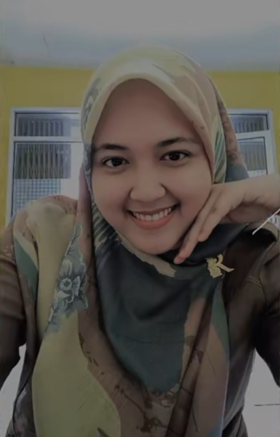
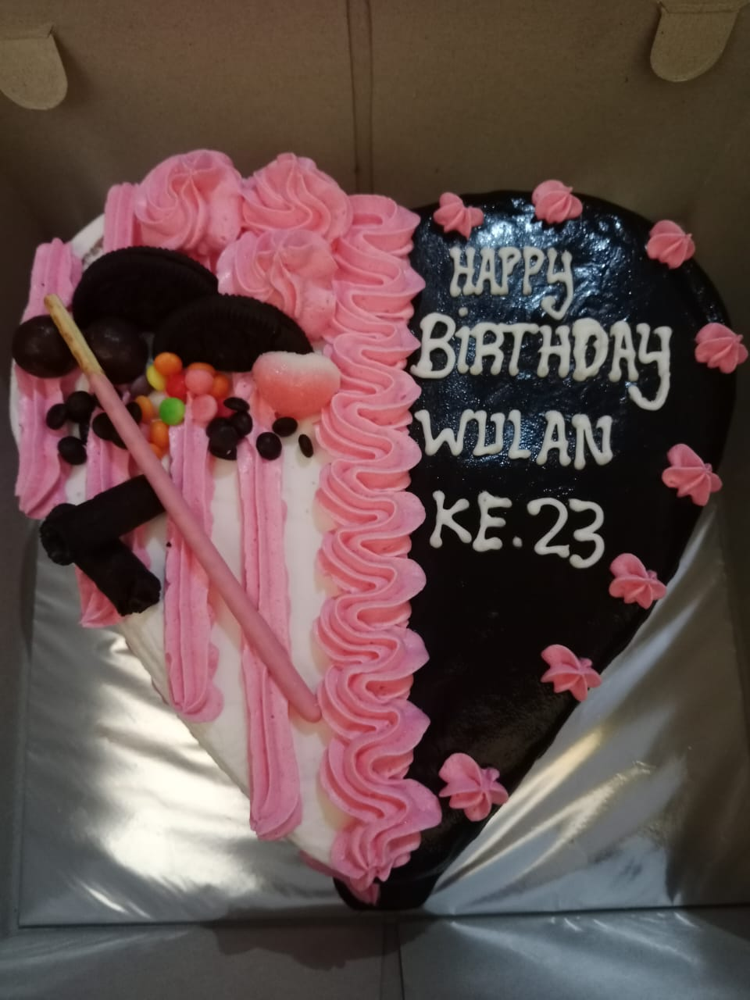

<!DOCTYPE html>
<html lang="id">
<head>
    <meta charset="UTF-8">
    <meta name="viewport" content="width=device-width, initial-scale=1.0">
    <title>Ucapan Ulang Tahun</title>
    
</head>
<body>
    

        <h1>Selamat Ulang Tahun, Kakak!</h1>
        
Hari ini adalah hari yang spesial karena kita merayakan ulang tahunmu yang ke-23. Semoga semua impian dan harapanmu tercapai. Terima kasih telah menjadi kakak yang selalu mendukung dan menginspirasi. Kamu adalah contoh yang luar biasa dalam hidupku.

        
Semoga tahun ini membawa banyak kebahagiaan, kesehatan, dan kesuksesan. Tetaplah menjadi pribadi yang kuat dan penuh kasih seperti yang selama ini aku kenal. Aku sangat bersyukur memiliki kakak sepertimu.

        
Selamat merayakan hari istimewamu!

        
Dengan cinta, [Azis]

        
        
    

</body>
</html>
